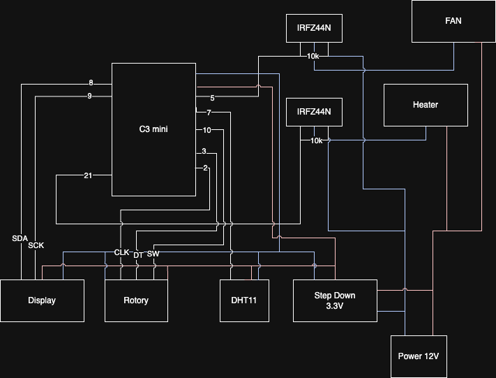

# Fermentation Chamber Controller

An ESP32-based intelligent fermentation chamber controller that maintains precise temperature and humidity control for optimal fermentation conditions. Features an OLED display, rotary encoder interface, and software PWM control for fan and heater management.

## 🎥 Demo Video

[](https://youtu.be/tLW_WAPdoeg)
[](https://youtu.be/uAKlWe1nWns)

## Features

- **Precise Temperature Control**: Maintains target temperature using PID-like control with heater management
- **High-Accuracy Humidity Monitoring**: Real-time humidity tracking with BME280 sensor (±3% accuracy)
- **Smart Fan Control**: Variable speed fan control based on temperature and humidity differentials
- **Interactive Interface**: OLED display with rotary encoder for easy parameter adjustment
- **Timer Functionality**: Built-in countdown timer for fermentation processes
- **Persistent Settings**: Automatically saves and restores user preferences
- **Software PWM**: Efficient software-based PWM control for both fan and heater
- **I2C Communication**: Reliable I2C-based sensor communication for improved accuracy

## Hardware Requirements

### Components
- Connectors: https://de.aliexpress.com/item/1005007460897865.html
- Pin headers: https://de.aliexpress.com/item/4000873858801.html
- Heat Pad: https://de.aliexpress.com/item/4001309920804.html
- Humidifier: https://de.aliexpress.com/item/1005008882836452.html
- Screw headers: https://de.aliexpress.com/item/1005008165668449.html
- Fan: https://de.aliexpress.com/item/1005007144892529.html
- 5V Step Down: https://de.aliexpress.com/item/1005001629723875.html
- BME280: https://de.aliexpress.com/item/32662970772.html
- MOSFET (IRLZ44N): https://de.aliexpress.com/item/1005006228628494.html
- Display with Rotary Encoder: https://de.aliexpress.com/item/1005008817896911.html
- ESP32: https://de.aliexpress.com/item/1005007205044247.html
- Resistor (10k): https://de.aliexpress.com/item/32952657927.html
- Power Supply: https://de.aliexpress.com/item/1005006823353722.html
- Cable Tape: https://de.aliexpress.com/item/1005008158457854.html
- Hardware from Hardware Store:
   - Plywood 4mm A4
   - Saw / Drill / Wood Glue

### Libraries Used
- `U8g2` - OLED Display Library
- `Adafruit BME280 Library` - High-precision Temperature/Humidity/Pressure Sensor
- `Ai Esp32 Rotary Encoder` - Rotary Encoder Interface

## Pin Configuration

| Component | ESP32-C3 Pin |
|-----------|--------------|
| BME280 SDA | GPIO 8 (I2C) |
| BME280 SCL | GPIO 9 (I2C) |
| Encoder CLK | GPIO 2 |
| Encoder DT | GPIO 3 |
| Encoder SW | GPIO 10 |
| Fan Control | GPIO 5 |
| Heater Control | GPIO 21 |
| Vaporizer Control | GPIO 0 |
| OLED SDA | GPIO 8 (I2C) |
| OLED SCL | GPIO 9 (I2C) |

## Wiring Diagram

```
ESP32-C3 Mini
    │
    ├── GPIO 8  ──── I2C SDA (BME280 + OLED)
    ├── GPIO 9  ──── I2C SCL (BME280 + OLED)
    ├── GPIO 2  ──── Rotary Encoder CLK
    ├── GPIO 3  ──── Rotary Encoder DT
    ├── GPIO 10 ──── Rotary Encoder SW (Button)
    ├── GPIO 5  ──── Fan Control (via MOSFET/Relay)
    ├── GPIO 21 ──── Heater Control (via MOSFET/Relay)
    └── GPIO 0  ──── Vaporizer Control (via MOSFET/Relay)
```

Outdated: 


## Installation

1. **Clone the Repository**
   ```bash
   git clone <repository-url>
   cd fermentation_chamber
   ```

2. **Install PlatformIO**
   - Install [PlatformIO IDE](https://platformio.org/platformio-ide) or PlatformIO Core
   - Alternatively, use the PlatformIO extension in VS Code

3. **Build and Upload**
   ```bash
   # Build the project
   pio build

   # Upload to ESP32
   pio upload

   # Monitor serial output (optional)
   pio device monitor
   ```

## Usage

### Basic Operation

1. **Power On**: The system will display current temperature and humidity readings
2. **Navigation**: 
   - Rotate encoder to navigate between menu items
   - Press encoder button to enter/exit edit mode
   - Long press (1 second) to access timer functions

3. **Menu Items**:
   - **Temperature Target**: Set desired temperature (0-40°C)
   - **Humidity Target**: Set desired humidity (0-100%)
   - **Timer**: Set countdown timer (0-999999 seconds)

### Control Logic

- **Heater**: Activates when temperature is below target minus threshold
- **Fan**: 
  - Primary function: cooling when temperature exceeds target
  - Secondary function: humidity control when temperature is within range
  - Minimum PWM ensures reliable fan operation
- **Vaporizer**: Activates when humidity is below target to increase humidity levels

### Timer Functionality
- Set timer duration using rotary encoder
- Long press to start/stop timer
- Timer persists through power cycles
- Visual countdown display

## Configuration

Key parameters can be adjusted in `include/config.h`:

```cpp
// Control thresholds
#define TEMP_THRESHOLD_LOW 1      // Degrees below target to activate heater
#define FAN_PWM_MIN 0           // Minimum fan PWM 
#define FAN_PWM_START 50        // PWM value to start the fan (kick-start)
#define FAN_PWM_MAX 255         // Maximum fan PWM
#define HEATER_PWM_MIN 0        // Minimum heater PWM
#define HEATER_PWM_MAX 255      // Maximum heater PWM
#define SENSOR_READ_INTERVAL 500  // Sensor reading frequency (ms)

// PWM frequency
#define FAN_PWM_FREQ_SOFT 10     // Software PWM frequency (Hz)

// I2C configuration
#define BME280_I2C_ADDRESS 0x76  // BME280 I2C address

// Range limits
#define TEMP_MIN 0              // Minimum temperature (°C)
#define TEMP_MAX 40             // Maximum temperature (°C)
#define HUM_MIN 0               // Minimum humidity (%)
#define HUM_MAX 100             // Maximum humidity (%)
```

## Architecture

The project follows a functional programming approach with clear separation of concerns:

- **`main.cpp`**: Main loop and hardware initialization
- **`sensors.cpp`**: BME280 sensor reading (high accuracy, no compensation needed)
- **`controls.cpp`**: Fan and heater control logic
- **`display.cpp`**: OLED display management
- **`input.cpp`**: Rotary encoder and button handling
- **`timer.cpp`**: Timer functionality
- **`persistence.cpp`**: Settings storage and retrieval

## Troubleshooting

### Common Issues

1. **Sensor Reading Failures**
   - Check BME280 I2C wiring and power supply
   - Verify I2C address in `config.h` (try 0x77 if 0x76 doesn't work)
   - Use I2C scanner to find the correct address

2. **Fan Not Starting**
   - Ensure `FAN_PWM_MIN` is set appropriately for your fan
   - Check MOSFET/relay wiring

3. **Display Issues**
   - Verify I2C connections (SDA/SCL)
   - Check I2C address in display initialization

4. **Encoder Not Responding**
   - Verify encoder wiring and pin configuration
   - Check for proper debouncing in code

## Contributing

1. Fork the repository
2. Create a feature branch
3. Make your changes following the coding standards:
   - Pure functions where possible
   - Minimal side effects
   - C++ best practices
   - Function comments in header files only
4. Submit a pull request

## License

This project is open source. Please check the license file for details.

## Acknowledgments

- Built with PlatformIO framework
- Uses Arduino framework for ESP32
- Inspired by the fermentation community's need for precise environmental control 